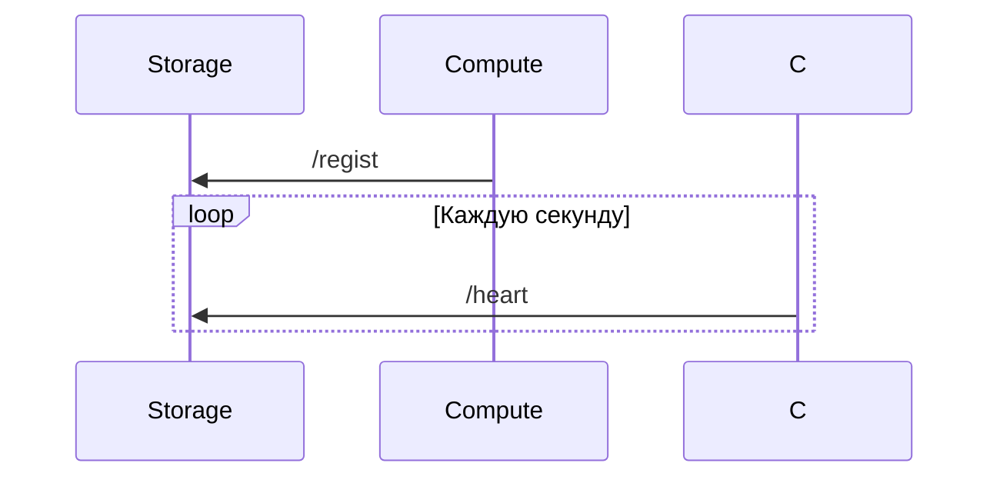

<!--Описание-->
## Вводная часть
Проект состоит из двух частей: Storage и Computation серверов. На Storage приходят запросы о добавлении математической задачи, он отслеживает серверы вычислений, контроллирует вычисление. На Computation приходит только число и операция, в ответ приходит число.

<!--Установка-->
# Установка
```git clone https://github.com/XJIeI5/calculator.git```

```go get .```


<!--Запуск-->
# Компиляция

### Storage сервер
```cd cmd/storage```

```go build server.go```

```start server.exe --port=3000```

флаги:
- host: хост сервера, по умолчанию "http://localhost"
- port: порт сервера, по умолчанию 8080

### Computation сервер
```cd cmd/compute ```

```go build server.go```

```start server.exe --pc=5 --port=5000```

флаги:
- host: хост сервера, по умолчанию "http://localhost"
- port: порт сервера, по умолчанию 8080
- pc: parallel computations, количество запущенных горутин, по умолчанию 10

<!--Запросы-->
# Запросы
### Storage сервер

- /regist_compute

> POST-запрос, ContentType application/json
> 
> тело запроса: json {"addr": "*адрес сервера вычислений*"}
> 
> возвращает статус-код

> чтобы сервер вообще мог послать запрос на вычисление, надо зарегестрировать сервер вычислений. но делать это надо не через этот запрос, а через запрос на регистрацию самого вычислительного сервера

> не следует делать этот запрос для регистарции сервера вычислений

- /add_expr

> POST-запрос, ContentType application/json
> 
> тело запроса: json {"expr": "*выражение*"}
> 
> возвращает id выражения (число)

> возвращает id выражения, по запросу /get_result можно получить результат

> curl --location 'http://localhost:3000/add_expr' \
> --header 'Content-Type: application/json' \
> --data '{"expr": "1 + 1"}'

- /get_result
  
> GET-запрос
> 
> url-query: ?id=*id выражения*
> 
> возвращает json {"state": "*состояние вычисление*", "result": "*ответ*"}

> возвращает состояние вычисления и его результат

> curl --location 'http://localhost:3000/get_result?id=1433202860'

- /set_timeout
  
> POST-запрос, ContentType application/json
> 
> тело запроса: json {"timeout": {"*символ операции*": *время в миллисекундах*}
> 
> возвращает статус-код

> задает время выполнения различных операций. перезаписывает указанные в теле запроса, оставляет без изменений неуказанные. чтобы изменить время ожидания heartbeat'а от сервера вычислений, *символ операции* должен быть "__wait"

> curl --location 'http://localhost:3000/set_timeout' \
> --header 'Content-Type: application/json' \
> --data '{"timeout": {"+": 10000}}'

- /heart
  
> GET-запрос
> 
> возвращает статус-код

> обновляет время последнего пинга от сервера вычислений, который прислал запрос. если время, которое сервер вычислений не присылал пинг, больше пяти секунд, он считается недоступным.
> если не присылал больше времени, определяемого "__wait" в /set_timeout запросе, сервер вычислений удаляется из списка доступных и его надо заново регистрировать

> не следует делать этот запрос для пинга

- /get_compute

> GET-запрос
> 
> возвращает json [{"addr": "*адрес сервера вычислений*", "state": "*состояние*", "last_beat": "*время последнего пинга*"}, ...]

> возвращает сервера вычислений и их состояние

> curl --location 'http://localhost:3000/get_compute'

### Computation сервер

- /regist

> POST-запрос, ContentType application/json
>
> тело запроса: json {"addr": "*адрес сервера хранения*"}
>
> возвращает статус-код

> этот запрос регистрирует сервер вычислений для сервера хранения. теперь этот сервер может быть задействован для вычислений

> curl --location 'http://localhost:5000/regist' \
> --header 'Content-Type: application/json' \
> --data '{"addr": "http://localhost:3000"}'

- /exec

> POST-запрос, ContentType application/json
>
> тело запроса: json {"op_info": {"a": *первое число*, "b": *второе число*, "op": "*символ операции*"}, "duration": *количество времени в миллисекундах для выполнения операции*}
>
> возвращает число

> запрос для подсчета операции. пока поддерживаются только бинарные ( с двумя числами )

> curl --location 'http://localhost:5000/exec' \
> --header 'Content-Type: application/json' \
> --data '{"op_info": {"a": 10, "b": 0.5, "op": "*"}, "duration": 500}'

- /free_process

> GET-запрос
>
> возвращает число

> возвращает количество незанятых процессов, которые можно использовать для параллельного вычисления на этом сервере

> curl --location 'http://localhost:5000/free_process'

# Диаграмма


# Пример

```
start cmd/compute/server.exe --port=5000

start cmd/compute/server.exe --port=6000

start cmd/storage/server.exe --port=3000

curl -L 'http://localhost:5000/regist' -H 'Content-Type: application/json' -d '{"addr": "http://localhost:3000"}'

curl -L 'http://localhost:6000/regist' -H 'Content-Type: application/json' -d '{"addr": "http://localhost:3000"}'

curl -L 'http://localhost:3000/set_timeout' -H 'Content-Type: application/json' -d '{"timeout": {"+": 10000}}'

curl -L 'http://localhost:3000/add_expr' -H 'Content-Type: application/json' -d '{"expr": "10 * (2 + 1)"}'

curl -L 'http://localhost:3000/get_result?id=2146560825'

curl -L 'http://localhost:3000/add_expr' -H 'Content-Type: application/json' -d '{"expr": "30 + 0.5"}'

curl -L 'http://localhost:3000/get_result?id=2146560825'
```

